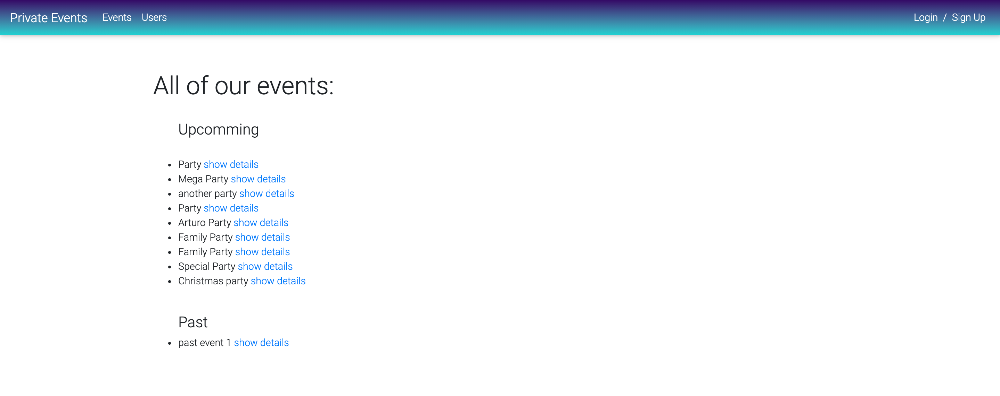

# Private Events

This Private events app allows the to signup or login. The users create events, set a title, set a date and a little description for each event. Other users can attend events, one user can attend many events and an event can be attended by many users.
## Screenshot

## Live Demo

[Live Demo Link](https://sleepy-river-71785.herokuapp.com/)

## Built With 🛠

- Ruby: 2.6.3
- Ruby on Rails: 6.0.3.4
- VS Code
- MDBootstrap
- SQLite

## Installation ⏳

1. - Clone this repo https://github.com/Yors-git/private-events
2. - Enter the directory
3. - Run 'bundle install' to install the gems that the app uses
4. - Create your DB with 'rails db:create'
5. - Migrate the DB with 'rails db:migrate'
6. - Run 'rails s' to create your database
7. - Go to http://localhost:3000/ in your browser to get the app running

## Author

### 👨‍💻 Jorge Torres

- Github: [Jorge Torres](https://github.com/Yors-git)
- Linkedin: [Jorge Torres](https://www.linkedin.com/in/jtbribiesca/)
- Twitter: [@Yors_82](https://twitter.com/Yors_82)

### 🤝 Contributing

Contributions, issues and feature requests are welcome!

### Show your support

Give a ⭐️ if you like this project!

### License

This is a Microverse project, all rights reserved to Jorge Torres